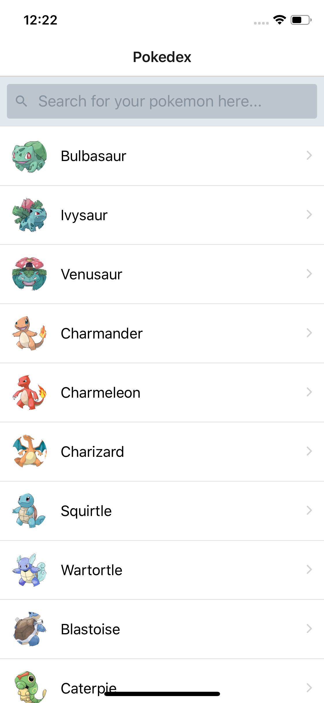
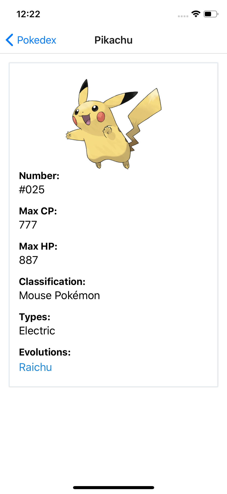

# pokedex-react-apollo
A simple Pokedex that displays all first-gen Pokemons and their details 

## Dependencies used
- expo
- react-apollo
- react-navigation
- react-native-elements
- apollo-cache-inmemory
- apollo-client
- apollo-link-http
- graphql
- graphql-tag

## Screenshots
<!--  -->

